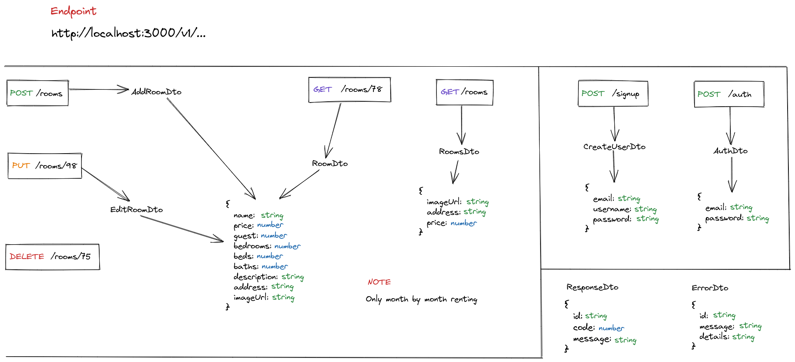

<p align="center">
  
</p>

## Description

Room-Renting is a very basic api, that it allows to you to manage a small business of room renting like airbnb.

## Installation

```shell
$ npm install
```

## Running the app

```shell
# development
$ npm run start

# watch mode
$ npm run start:dev

# production mode
$ npm run start:prod
```

## Test

```shell
# unit tests
$ npm run test

# e2e tests
$ npm run test:e2e

# test coverage
$ npm run test:cov
```

## Env Variable

```shell
PORT = 0000

DB_ENDPOINT = ""

USER_AVATAR = ""

ROOM_IMAGE = ""
```
